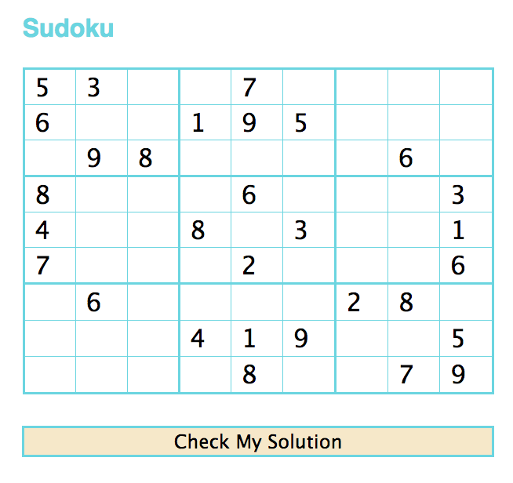

Simply Sudoku by <a href="https://www.linkedin.com/in/savannahhenderson">Savannah Henderson</a>
=========
###### Sudoku.

<strong>Simple web app that allows users to play sudoku, runs test to check their answers, and lets them know if they have won.</strong>

####Table of Contents
- [Stack](#stack)
- [Try it Yourself](#getting-started)
- [Walk Through](#walk-through)
  - [Submitting Answers](#submitting-answers)
  - [Incomplete](#incomplete)
  - [You've Won!](#winning)
  - [You've Lost!](#losing)
- [Future Plans](#future-plans)

###### Stack:

*	JavaScript
*	JQuery
*	HTML/CSS
*   Sass
*   Jade

###### Try it yourself:

1) First, clone this directory to your computer.

<pre><code>$ git clone https://github.com/savannahjune/sudoku.git</code></pre>

2) Drag the main.html file into any browser and begin playing!

3) If you want to continue working on the project, you will need to install Sass and Jade. 

###### Walk Through:

When you first load the page you will see an unfinished Sudoku grid. You can type in your answers or you can use the toggles to choose your number from 1-9.  If you have never played sudoku, or forget how to play, you can read the rules <a href="http://en.wikipedia.org/wiki/Sudoku">here.</a> Fill in your answers and click "Check My Solution" when you are finished.

###### Submitting Answers:

<pre><code>

</code></pre>

###### Incomplete:

###### Winning:

###### Losing:

 

###### Future Plans:

The tree icon is entitled 'Tree' by Mister Pixel from The Noun Project.

The train icon is entitled 'Train' by Jamison Wieser from The Noun Project.

Thanks!
